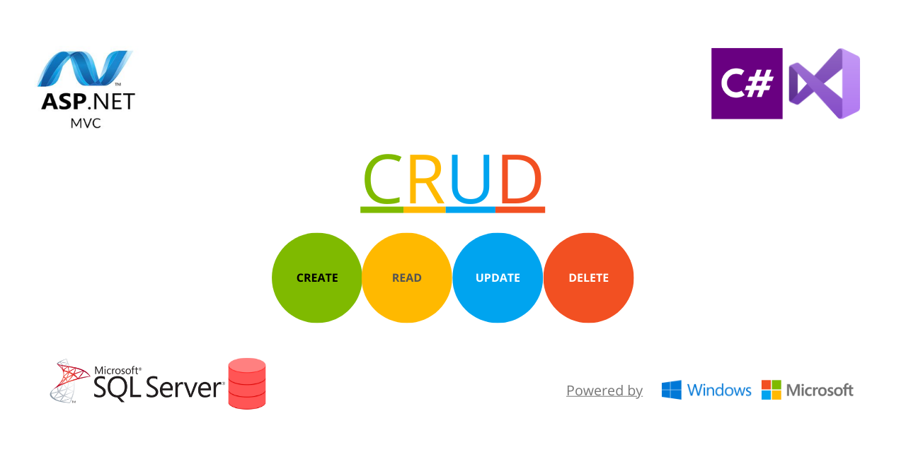

---------------------------------------------------------

-----------------------------------------------------

# Assignment2_CRUD

You  are  required  to  produce  a  solution  that  implements a <strong>CRUD</strong> using <strong>MVC</strong> methodologies for the entity <strong>Trainers</strong>.

<h2>Tasks</h2>

<h3>You    need    to    submit    all    the    produced    files    in    a    zip    file    named    by your_name_individual_partb.zip</h3>
<ul>
    <li> <h3>Create Trainer [20marks]</h3> </li>
    <li> <h3>Read Trainer details [20marks] </h3> </li>
    <li> <h3>Update Trainer details [20marks]</h3></li>
    <li> <h3>Delete Trainer [20marks] </h3></li>
    <li> <h3>Use of MVC technologies [20marks]</h3></li>
  </ul>

------------------------------------------------------------------------------------------------------------------------------------------------------

📋Table of contents
=================

<!--ts-->

* [ApplicationDatabase](#applicationdatabase)
    * [ApplicationContext](#applicationcontext)
* [Migrations](#migrations)
    * [Configurations](#configurations)
* [Model](#model)
   * [Trainer](#trainer)
* [Controller](#controller)
    * [TrainerController](#trainercontroller)
* [Interfaces](#interfaces)
   * [IPerson](#iperson)
* [Repository](#repository)
   * [TrainerRepository](#trainerrepository)
* [View](#view)
   * [Trainer_view](#trainer_view)
     * [Create](#create)
     * [Read](#read)
     * [Edit](#edit)
     * [Delete](#delete)
* [Installation](#installation)
* [Technologies](#technologies)

  
<!--te-->

## ApplicationDatabase ##
### ApplicationContext ###

----------------------------------------------------------------------------------------------------------

## Migrations ##
### Configurations ###

----------------------------------------------------------------------------------------------------------

## Model ##

### Trainer ###

| Type           | Properties       | Methods | Required | Min| Max | 
| :---:          |     :---:        |  :---:  |  :---:  | :---: | :---: | 
| int            | ID     | get, set   | ☑️ | 1 | no-limit | 
| string            | FirstName     | get, set   |☑️ | 10 | 50 |
| string         | LastName      | get, set    |☑️| 10 | 50 |
| string         | PhoneNumber       | get, set    |☑️| 10 | 20 |
| int         | Salary       | get, set    |☑️| 1000 | 3000 |

#### Validation Error Messages ####

| ErrorMessageCode         | ErrorMessage       | 
| :---:          |     :---:        | 
| int            | ID     | 
| string            | FirstName     | 
| string         | LastName      |
| string         | PhoneNumber       | 
| int         | Salary       | 

##### [Back to >Top<](#assignment2_crud) #####
-------------------------------------------------------------------------------------------------------------------

## Interfaces ##
### IPerson ###

| Type           | Properties       | Methods |
| :---:          |     :---:        |  :---:  |
| int            | ID     | get, set   |
| string            | FirstName     | get, set   |
| string         | LastName      | get, set    |
| string         | PhoneNumber       | get, set    |
| int         | Salary       | get, set    |

-------------------------------------------------------------------------------------------------------------------

## Repository ##
### TrainerRepository ###

| Method           | Properties       | Methods |
| :---:          |     :---:        |  :---:  |
| int            | ID     | get, set   |
| string            | FirstName     | get, set   |
| string         | LastName      | get, set    |
| string         | PhoneNumber       | get, set    |
| int         | Salary       | get, set    |

##### [Back to >Top<](#assignment2_crud) #####
------------------------------------------------------------------------------------------------------------------
## View ##

### Create ###
-
------------------------------------------------------------------------------------------------------------------
### Read ###
-

##### [Back to >Top<](#assignment2_crud) #####
------------------------------------------------------------------------------------------------------------------
### Edit ###
-
------------------------------------------------------------------------------------------------------------------
### Delete ###
-
##### [Back to >Top<](#assignment2_crud) #####
------------------------------------------------------------------------------------------------------------------
## Controller ##
### TrainerController ###

| Method           | Properties       | Methods |
| :---:          |     :---:        |  :---:  |
| Action            | ID     | get, set   |
| Action            | FirstName     | get, set   |
| Action         | LastName      | get, set    |
| Action         | PhoneNumber       | get, set    |
| Action         | Salary       | get, set    |

## Installation ##

## Technologies ##

- [C#](https://docs.microsoft.com/en-us/dotnet/csharp/)
- [Entity Framework](https://docs.microsoft.com/en-us/ef/ef6/)
- )
- [Visual Studio Community Edition](https://visualstudio.microsoft.com/vs/community/)
- [Microsoft SQL Server](https://www.microsoft.com/en-us/sql-server/sql-server-downloads)
- [HTML](https://www.w3schools.com/html/)
- [CSS](https://www.w3schools.com/css/)
- [Boostrap 4](https://getbootstrap.com/)
- [Font Awesome](https://fontawesome.com/)

##### [Back to >Top<](#assignment2_crud) #####
